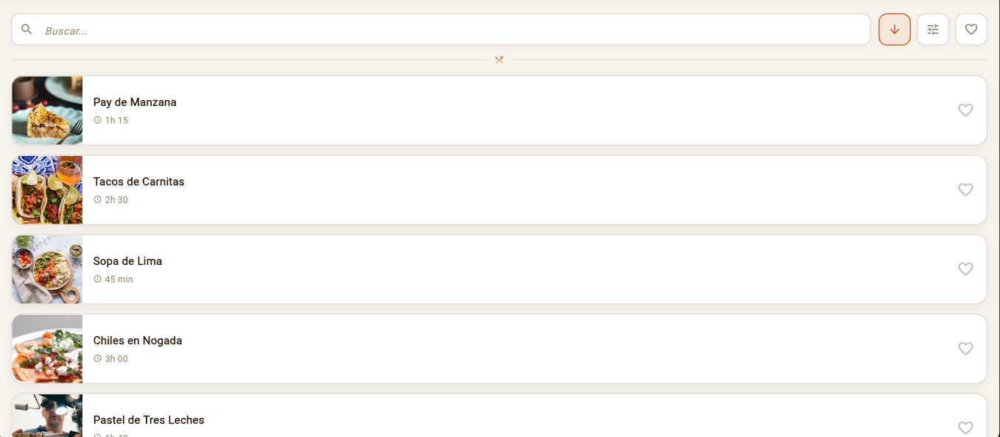
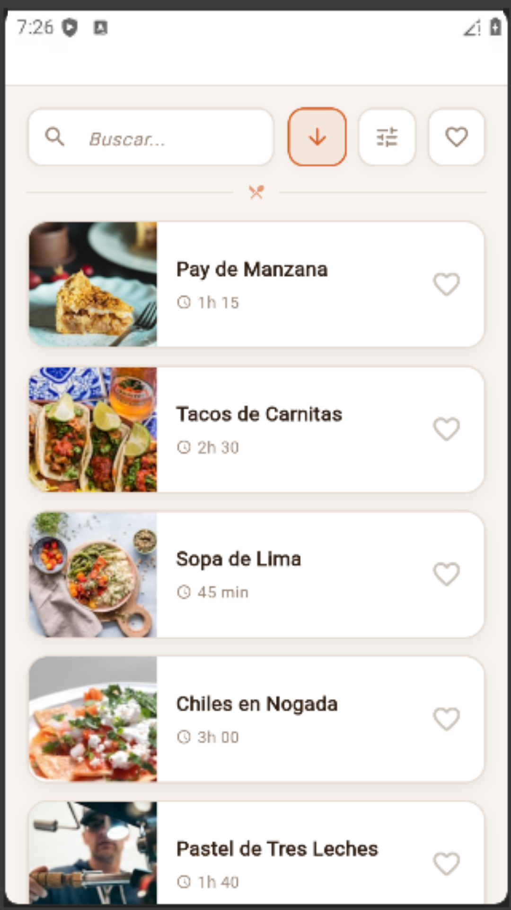
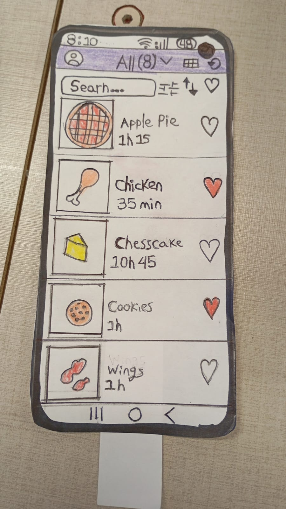

# ReciveRecipe

# Mi Prompt

Desarrolla un código de dart simple, sin librerías externas y con los estilos dentro del mismo archivo.

- Deja la appbar vacía, pero puesta para hacerla en otra ocacion
- Nos vamos directo al body, justo debajo de donde debería estar la app bar, está la barra de búsqueda simple con un texto placeholder que dice "Buscar..."  de lado derecho de la barra alineado con la barra de búsqueda van las opciones de filtros, uno de más reciente a más antiguo uno de filtros en general, y un botón de corazón que debe ser los marcados como gustados.
- Justo debajo de la sección de filtros, búsqueda y gustado, va un contenedor grande con tarjetas (recetas) que mostraran una imagen de la web y justo a la derecha de la imagen saldra el titulo de la tarjeta (nombre de la receta, Ej. Pay de manzana), un subtitulo que diga la duracion de la receta en este formato "1h 15" y en el extremo derecho de la tarjeta un icono de corazon con la posibilidad de toggle.
- Y replica esta misma tarjeta 4 veces mas cambiando de receta.

# Diseño

